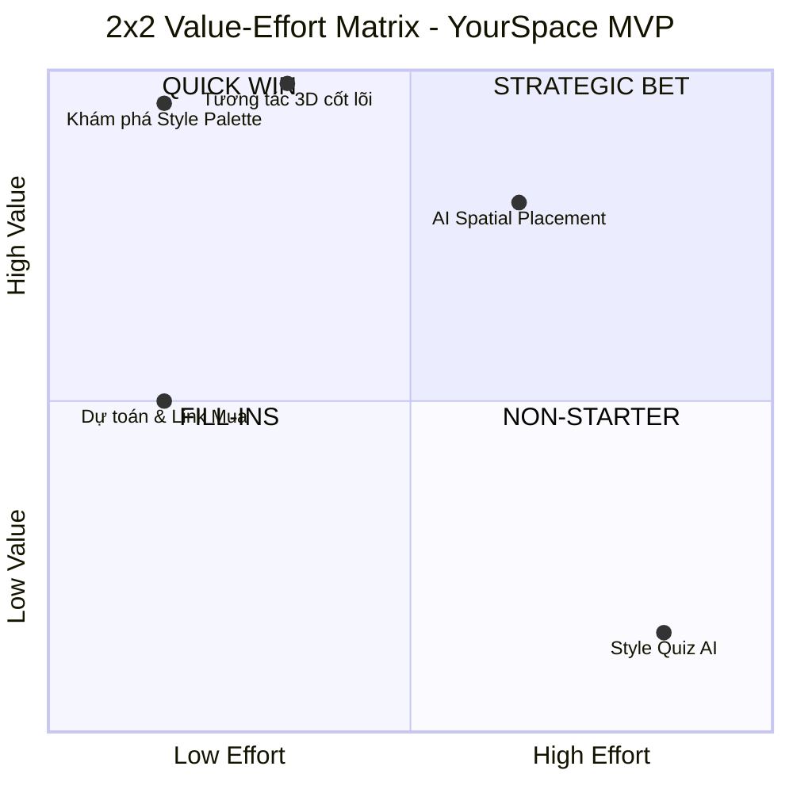
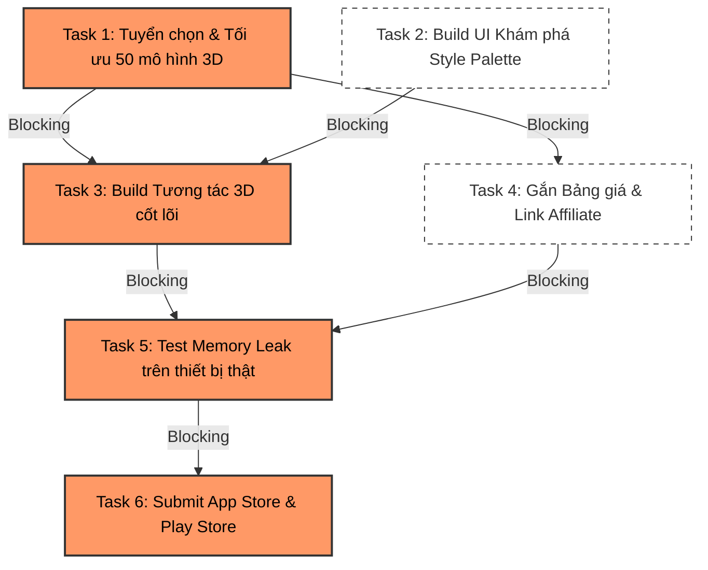

# Phân tích Giá trị & Roadmap MVP (Day 20)

Tài liệu này tổng hợp kết quả phân tích độ ưu tiên tính năng (RICE, Ma trận Value-Effort) và Roadmap triển khai của YourSpace MVP, phục vụ cho việc trình bày chiến lược sản phẩm với VC.

---

## 1. Bảng chấm điểm RICE (Giả định Reach = 10,000 users/quý)

| Tính năng | Reach (User/quý) | Impact (0.25-3) | Confidence (%) | Effort (Person-month) | RICE Score |
| :--- | :--- | :--- | :--- | :--- | :--- |
| **1. Khám phá "Style Palette"** *(Curated catalog phân loại theo phong cách)* | 10,000 *(100% user mở app đều dùng)* | 2 (High) | 100% | 1 | **20,000** |
| **2. Tương tác 3D cốt lõi** *(Upload ảnh, kéo thả, xoay, xóa 3D)* | 7,000 *(70% qua phễu onboarding)* | 3 (Massive) | 100% *(Tech React Native/GL đã rõ)*| 2 | **10,500** |
| **3. Dự toán chi phí & Link Mua** *(Hiển thị giá + redirect Affiliate)* | 3,000 *(30% chốt được bản thiết kế)*| 3 (Massive) | 100% | 1 | **9,000** |
| **4. AI Spatial Placement** *(Tự động scale đồ qua on-device Depth map)*| 7,000 *(70% qua phễu onboarding)* | 3 (Massive) | 80% *(Rủi ro sai số depth từ AI)* | 3 | **5,600** |
| **5. Style Quiz AI** *(AI Chat/Quiz để tìm phong cách)* | 10,000 *(Out-of-scope MVP)* | 1 (Medium) | 50% *(Chưa có data khách hàng training)*| 4 | **1,250** |

---

## 2. Ma trận 2x2 Value-Effort

*(Lưu ý: Trục Value trong ma trận tỷ lệ thuận với `Reach × Impact × Confidence`)*

### Đúc kết Quyết định Sản phẩm:
1. 🏆 **1 Quick Win (Làm trước): Khám phá Style Palette & Bảng Dự toán** (Effort thấp, Value cao, trực tiếp sinh doanh thu).
2. 🚀 **1 Strategic Bet trong MVP: AI Spatial Placement** (Wow factor, giảm ma sát scale thủ công, tạo rào cản công nghệ phòng thủ đối thủ).
3. 🚫 **1 Non-starter (Bỏ thẳng): Style Quiz AI** (Rủi ro data cao, không khả thi trong giai đoạn MVP bootstrap).

---

## 3. 🚀 YOURSPACE PRODUCT ROADMAP (Now/Next/Later)

### 🟢 NOW (Ưu tiên hiện tại)
*Tập trung vào giải quyết sự đắn đo cốt lõi và validate mô hình dòng tiền.*

* **Vấn đề 1: "Nghịch lý sự lựa chọn" khiến người dùng tê liệt.** 
Khách hàng bơi trong biển hàng chục nghìn sản phẩm đơn lẻ trên sàn TMĐT nhưng không biết kết hợp sao cho đúng gu, dẫn đến chần chừ không dám mua.
*(→ Giải quyết qua: Khám phá Style Palette)*
* **Vấn đề 2: Sự thiếu tự tin vì không thể hình dung không gian thật.**
Người mua không dám xuống tiền vì sợ món đồ đắt đỏ khi kê vào phòng mình trông sẽ lạc lõng, sai tông màu.
*(→ Giải quyết qua: Tương tác 3D cốt lõi trên ảnh 2D + AI Spatial Placement để tự động scale theo depth)*
* **Vấn đề 3: Đứt gãy giao dịch ở bước ra quyết định cuối cùng.**
Người dùng ưng ý không gian nhưng mù mờ về ngân sách thực tế và không có điểm chạm tin cậy để mua chính xác món đồ vừa phối.
*(→ Giải quyết qua: Bảng dự toán tự động & Link mua Affiliate)*

### 🟡 NEXT (Trọng tâm tiếp theo)
*Xây dựng hào nước phòng thủ công nghệ (Moat) và nâng cấp trải nghiệm Zero-friction.*

* **Vấn đề 1: AI Spatial Placement cần được harden sau khi launch MVP.**
MVP đã có auto-scale theo depth, nhưng cần tăng độ ổn định trên ảnh phòng Việt Nam: phòng tối, gương/kính, metadata model 3D bẩn, thiết bị yếu.
*(→ Giải quyết qua: accuracy benchmark, confidence fallback, cache depth map, QA pipeline cho 3D metadata)*
* **Vấn đề 2: Khan hiếm nguồn dữ liệu sản phẩm 3D bản địa.**
Dữ liệu 3D ban đầu chỉ là hàng mẫu chung chung, chưa phải hàng thật đang được bán bởi các nhãn hàng Việt Nam, làm giảm tỷ lệ chốt sale đơn giá cao.
*(→ Giải quyết qua: Mở rộng B2B Supplier Lock-in)*

### 🔴 LATER (Tầm nhìn dài hạn)
*Chuyển đổi sang trải nghiệm cá nhân hóa tuyệt đối (Done-for-you).*

* **Vấn đề 1: Khách hàng muốn hệ thống tự "đọc vị" gu thẩm mỹ.**
Tệp người dùng bận rộn muốn có một trợ lý AI thông minh tự động hiểu gu của họ từ số 0 (chỉ qua vài câu hỏi) và tự mix-match toàn bộ không gian thay vì họ phải tự tìm kiếm.
*(→ Giải quyết qua: Style Quiz AI & Gen-AI Agent)*
* **Vấn đề 2: Giới hạn góc nhìn của hình ảnh 2D tĩnh.**
Hình ảnh chụp một góc phòng không thỏa mãn được khát khao "bước đi" trong không gian tương lai từ nhiều góc độ đối với các căn nhà đang thi công phần thô.
*(→ Giải quyết qua: Tích hợp AR/LiDAR 3D scanning)*

---

## 4. 🎯 OKR Quý 1 (Focus cho giai đoạn NOW)

*Bộ mục tiêu này được thiết kế để trình bày với Investor, chứng minh team tập trung vào Outcome (kết quả kinh doanh/hành vi) thay vì Output (số lượng tính năng).*

**🔥 OBJECTIVE:** 
**Chứng minh YourSpace là "điểm chạm" triệt tiêu hoàn toàn sự đắn đo khi mua sắm nội thất của người trẻ.**
*(Định tính, truyền cảm hứng, trực tiếp giải quyết 3 Vấn đề ở cột NOW).*

**📈 KEY RESULTS:**
* **KR1 (Leading - User Behavior):** Tỷ lệ người dùng tải app hoàn thành việc ướm thử đồ và lưu lại bản thiết kế căn phòng (Save/Share Rate) đạt **30%**.
  *(Đo lường ý định thực sự, dự báo tỷ lệ chuyển đổi).*
* **KR2 (Lagging - Business Metric):** Tỷ lệ người dùng nhấp vào liên kết "Mua hàng/Nhận tư vấn" (Click-to-Buy Rate) trên tổng số người đã lưu bản thiết kế đạt **15%**.
  *(Đo lường trực tiếp khả năng sinh doanh thu Affiliate/Lead generation).*
* **KR3 (Quality - Retention):** Tỷ lệ người dùng quay lại tiếp tục chỉnh sửa không gian hoặc tạo thiết kế mới trong vòng 7 ngày (D7 Retention) đạt **25%**.
  *(Đo lường giá trị cốt lõi: app có thực sự hữu ích hay người dùng chỉ tò mò dùng 1 lần rồi xóa).*

---

## 5. 🛡️ Risk Management & Critical Path (Giai đoạn NOW)

*Tài liệu phòng thủ (Defensibility) cuối cùng trong Investor Package, chứng minh khả năng execution và quản trị rủi ro của Founder trong 30 ngày tới.*

### A. 3 External Dependencies (Nguy cơ có thể "giết" dự án trong 30 ngày tới)

**1. Apple App Store / Google Play Review (Quy trình duyệt App)**
* **Worst-case scenario:** App bị reject sát ngày ra mắt do các quy định khắt khe của Apple về giao diện tối thiểu hoặc phát sinh lỗi crash bộ nhớ khi render 3D trên thiết bị của reviewer.
* **Plan B:** Deploy khẩn cấp phiên bản Web App (PWA) qua Vercel để user truy cập và trải nghiệm 3D trực tiếp trên trình duyệt Safari/Chrome mobile, hoàn toàn bỏ qua App Store.
* **Cost:** $0 (Vercel Free) + 3 ngày chuyển đổi cấu hình.

**2. Bản quyền Mô hình 3D (Sketchfab / CGTrader License)**
* **Worst-case scenario:** Bị report vi phạm bản quyền do dùng nhầm mô hình 3D dán nhãn "Non-commercial" (phi thương mại) vào một app có gắn link affiliate kiếm tiền, dẫn đến việc bị gỡ app và phạt tiền.
* **Plan B:** Lọc lại toàn bộ catalog, mua đứt license "Royalty Free" cho khoảng 20 mô hình 3D thiết yếu nhất để đảm bảo an toàn pháp lý tuyệt đối cho phiên bản MVP.
* **Cost:** ~$200 USD + 2 ngày rà soát lại dữ liệu.

**3. Giới hạn băng thông Cloud (Cloud Bandwidth Limits)**
* **Worst-case scenario:** App bất ngờ viral, lượng user tải hàng nghìn file mô hình 3D (5-10MB/file) làm vượt giới hạn băng thông miễn phí của Firebase/Vercel, gây sập server diện rộng ngay ngày ra mắt.
* **Plan B:** Nén ép toàn bộ file 3D (áp dụng định dạng `.glb` với thuật toán Draco) xuống mức < 1MB và định tuyến luồng tải file qua hệ thống Cloudflare CDN caching.
* **Cost:** $20/tháng (Cloudflare Pro) + 1 ngày cấu hình hệ thống.

---

### B. Critical Path (Chuỗi công việc cốt lõi cho NOW)

Dưới đây là 6 Tasks chính cho cột NOW. Những task được **Highlight màu cam** chính là **Critical Path** (Chuỗi công việc dài nhất và rủi ro cao nhất, sự chậm trễ của chúng sẽ làm trễ toàn bộ dự án).

**Phân tích Critical Path:**
`[T1] Chuẩn bị Data 3D` → `[T3] Build tính năng Kéo thả 3D` → `[T5] Tối ưu hóa Memory Leak` → `[T6] Submit App`.
*Lý do:* Không có mô hình 3D thì không thể code tính năng kéo thả. Có tính năng kéo thả xong thì rủi ro cao nhất nằm ở việc vỡ bộ nhớ điện thoại (Memory Leak) khi render 3D. Vượt qua bài test này mới có thể submit lên Store. Các task UI và Data Affiliate có thể làm song song và không nằm trên đường cản trở chính.
